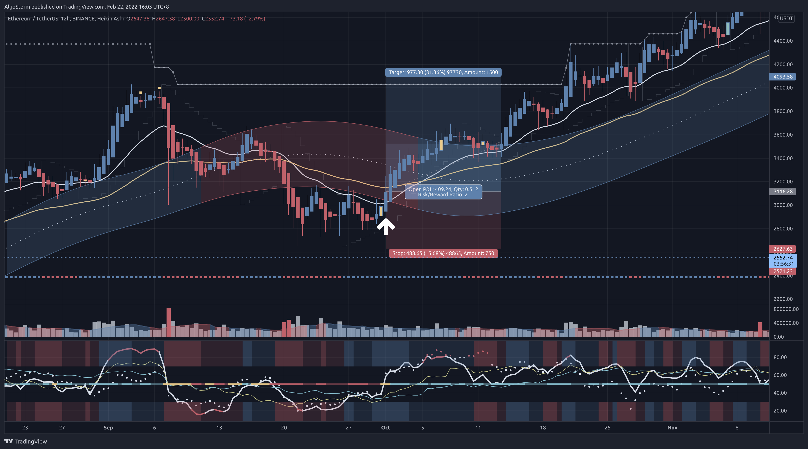

# RMD Trading Strategy

> Last Edited Date: 22/02/2022

## Introduction

This is a swing trading strategy that utilizes the AlgoStorm's premium indicators.

## Requirements

- This swing trading strategy is designed for **Cryptocurrencies**.
- First, you need to pick a Crypto exchange with low commissions.
- The asset needs to have very strong fundamentals, healthy on-chain metrics, and a good, reputable history.
- Check our Discord server for our selected list of assets that are suitable for trading and investing. To join, visit: [AlgoStorm.com](https://algostorm.com)

## Exchange Related Notes

- Our recommended exchange is [Bybit.com](https://www.bybit.com/en-US/invite?ref=YMYQ0%230)
- The commissions on [Bybit.com](https://www.bybit.com/en-US/invite?ref=YMYQ0%230) are (**0.075%**) per action.
- Due to the rebate rate of (**0.025%**) on [Bybit.com](https://www.bybit.com/en-US/invite?ref=YMYQ0%230), you will only have to pay (**0.05%**) commission per trade.
- To close the order, make a post-only limit order to secure the rebate rate rather than using the take-profit (TP) feature.

## Preparations

- Thoroughly analyze the market structure.
- Identify the **support** and **resistance** zones on 12-hour, daily, and weekly time frames.
- Plot the **anchored VWAP** from the swing high and the swing low on the 12-hour time frame.
- Draw the **trend lines** on the 12-hour time frame.

## Required Indicators

- The AlgoStorm Revolutionary Momentum Decoder (**RMD**) indicator.
- The AlgoStorm Supreme Market Compass (**SMC**) indicator.
- The AlgoStorm Advanced Volume Panel (**AVP**) indicator.

> **Note 1**: You also need an account on [TradingView.com](https://www.tradingview.com/gopro/?share_your_love=labinatorhub) to load the above indicators.

> **Note 2**: You gain access to the required indicators, please join us at [AlgoStorm.com](https://algostorm.com)

## Time Frames

- The 12-hour or the daily time frame.

## When To Enter?

- The **RMD (14)** must either be overbought (**above 70**) or oversold (**below 30**) depending on the direction of the trade. If the RMD was overbought/oversold within the last **4 candles**, it would still be valid.
- You require at least one Heikin Ashi candle without a wick to support the direction of your trade.
- The price action must cross the **21 Exponential Moving Average (EMA)** supporting the direction of the trade.
- Pay attention to the **volume spikes** on the Advanced Volume Panel (**AVP**) indicator. When you see a spike while the above conditions are valid, then it might be a good signal to start averaging in.
- It is considered an advantage if one or more of the following conditions also applies:
  - If the **RMD (28)** or **RMD (56)** or the **RMD of BTC** is also overbought/oversold depending on the direction of the trade.
  - If the **[B]** or the **[S]** signs on your chart are printed.
  - If the price action enters the **ASG Channel**.

## Where To Place The Stop Loss?

- Place the stop loss above/below a key level when the price action invalidates your initial analysis.

> **Note 1**: Some expert swing traders only enter long positions without leverage as a form of investment without a stop loss. Instead of using a stop loss, they mark certain invalidation levels and tune alarms. When the alarm rings, they evaluate the position before taking a decision.

> **Note 2**: Some expert swing traders when they are very confident about their decision and analysis, they trade without a stop loss while entering in stages similar to how a DCA bot behaves. Then they close the order in stages as well, at certain key levels. Instead of using a stop loss, they tune alarms and limit orders while thoroughly evaluating the position before taking a decision. This obviously requires more attention, experience, and work.

## When To Take Profit?

- When the **RMD (14)** is pointing to an overbought/oversold level depending on the direction of your trade or at a certain key level.
- You can also calculate the take profit by multiplying the distance of the stop loss from the entry by **2** as we are using a risk to reward ratio of **1:2**.

## Extra Pro Tips

1. For best results, practice the art of **entering** and **exiting** the order **in stages**.
2. It is advisable not to risk more than **2%-3%** per trade.
3. When you are starting out, do not use leverage. When you become consistently profitable for at least **8 months** in a row, you can then consider using very low leverage (**x2-x3**). Please keep in mind that many expert traders do not use leverage at all.

## Examples

### Example 1 - ETH/USDT (12-hour)

### Example 2 - ETH/USDT (12-hour)

