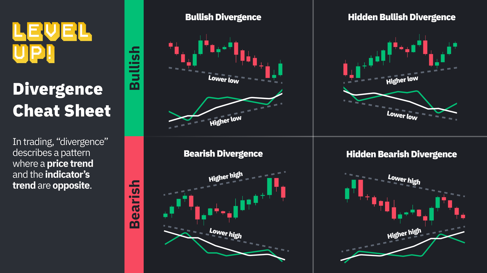
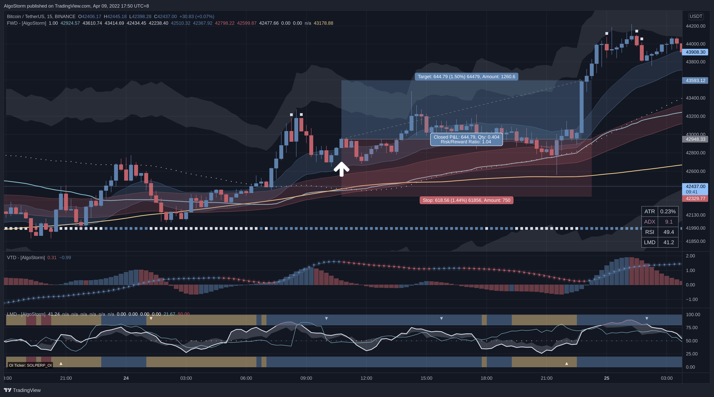
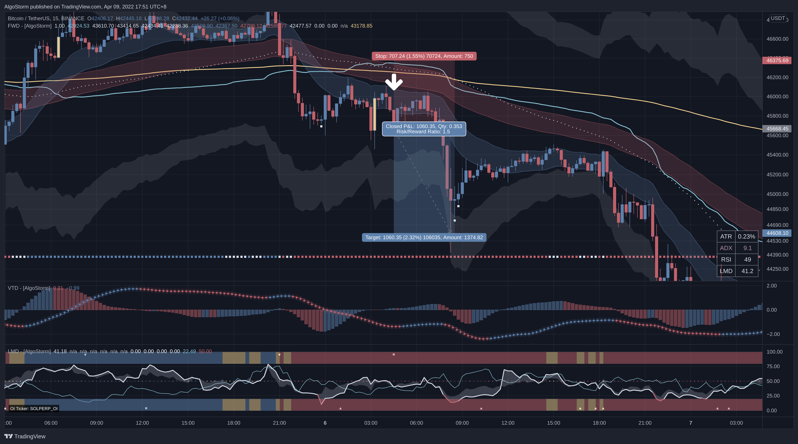

# Trend Following Strategy

> Last Edited Date: 09/04/2022

## Introduction

This is a trend following strategy that utilizes the AlgoStorm's premium indicators. It is suitable for both day traders and swing traders.

## Requirements

- This strategy is mostly designed for **Cryptocurrencies**. It can work though for other asset classes.
- First, you need to pick an exchange with low commissions.
- The asset needs to have a very high market cap. Preferably from the top 50 by market cap.
- The spread should be very high along with the daily volume.
- The asset needs to have very strong fundamentals, healthy on-chain metrics, and a good, reputable history.
- The assets must fluctuate by at least 1% every 4 hours on average.
- Check our Discord server for our selected list of assets that are suitable for trading. To join, visit: [AlgoStorm.com](https://algostorm.com)

## Exchange Related Notes

- Our recommended exchange is [Bybit.com](https://www.bybit.com/en-US/invite?ref=YMYQ0%230)
- Regardless of the exchange, to close the order, make a post-only limit order to save on fees rather than using the take-profit (TP) feature.

## Required Indicators

- The AlgoStorm Fire & Water Dragon (**FWD**) indicator.
- The AlgoStorm Volcanic Trend Dragon (**VTD**) indicator.
- The AlgoStorm Legendary Momentum Dragon (**LMD**) indicator.

> **Note 1**: You also need an account on [TradingView.com](https://www.tradingview.com/gopro/?share_your_love=labinatorhub) to load the above indicators.

> **Note 2**: You gain access to the required indicators, please join us at [AlgoStorm.com](https://algostorm.com)

## Time Frames

- Analyze the chart on the following time frames:
	- The daily time frame.
	- The 4-hour time frame.
	- The 15-minute time frame.
	- The 1-minute time frame.

> **Note 1**: Regardless of whether you are doing scalping, day trading, or swing trading, you always need to analyze the chart on all major time frames.

> **Note 2**: For day traders, we recommend monitoring the 15-minute charts. For swing traders, we recommend monitoring the 4-hour charts.

## Preparations

- Thoroughly analyze the market structure.
- Identify the **support/demand** and **resistance/supply** zones.
- Plot the **anchored VWAP** from the swing high and the swing low.
- Draw the **trend lines**.

## When To Enter?

### For Long Positions

- The price action must pull back towards the blue fast channel then you need to see a rebound off that channel.
- The blue fast channel must completely be above the red slow channel.
- The **LMD** indicator must not be **above 70** when entering the position.
- You need a **hidden bullish divergence** on the 15-minute time frame and a **regular bullish divergence** on the 1-minute time-frame. You can identify these divergences using both the **LMD** and **VTD** indicators. If you are swing trading, you can spot such divergences on the high time frames (e.g. The daily and the 4-hour).
- If you are day trading, then the price action must also be above the **VWAP** of the trading session and above the **200 linear regression slope** of the **FWD** indicator.

### For Short Positions

- The price action must pull back towards the blue fast channel then you need to see a rebound off that channel.
- The blue fast channel must completely be below the red slow channel.
- The **LMD** indicator must not be **below 30** when entering the position.
- You need a **hidden bearish divergence** on the 15-minute time frame and a **regular bearish divergence** on the 1-minute time-frame. You can identify these divergences using both the **LMD** and **VTD** indicators. If you are swing trading, you can spot such divergences on the high time frames (e.g. The daily and the 4-hour).
- If you are day trading, then the price action must also be below the **VWAP** of the trading session and below the **200 linear regression slope** of the **FWD** indicator.

## Where To Place The Stop Loss?

- Place the stop loss 0.2% beyond the slow red channel of the AlgoStorm's **FWD** indicator on the 15-minute time frame. You can also use the key levels on the 4-hour time frame if you are swing trading.

## When To Take Profit?

- Calculate the take profit by multiplying the distance of the stop loss from the entry by **1.5** as we are using a risk to reward ratio of **1:1.5**.
- You can also consider selling your order in stages at certain key levels.

## Extra Pro Tips

1. It is advisable not to risk more than **1%-2%** per trade.
2. When you are starting out, do not use leverage. When you become consistently profitable for at least **8 months** in a row, you can then consider using low leverage (**x2-x5**).

**Side Note:** Many professional traders **enter** and **exit** the market **in stages**.

## For Reference

As you have noticed, this strategy relies on divergences.
If you are new to the concept of divergences, a quick cheat sheet can be found below:

## Examples

### Example 1 - BTC/USDT - Long Position (15-min)

### Example 2 - BTC/USDT - Short Position (15-min)

---

!!!warning Important Note
Always **backtest** any strategy at least **300 times** before using it. We also advise new traders to forward test their strategies for several months before injecting any capital.
!!!