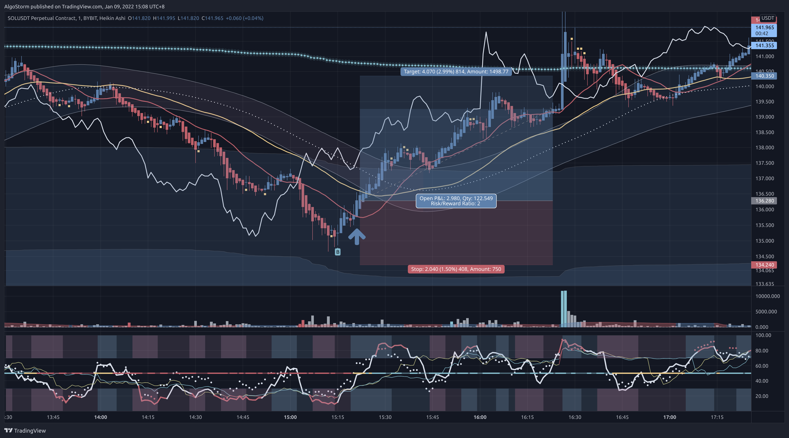
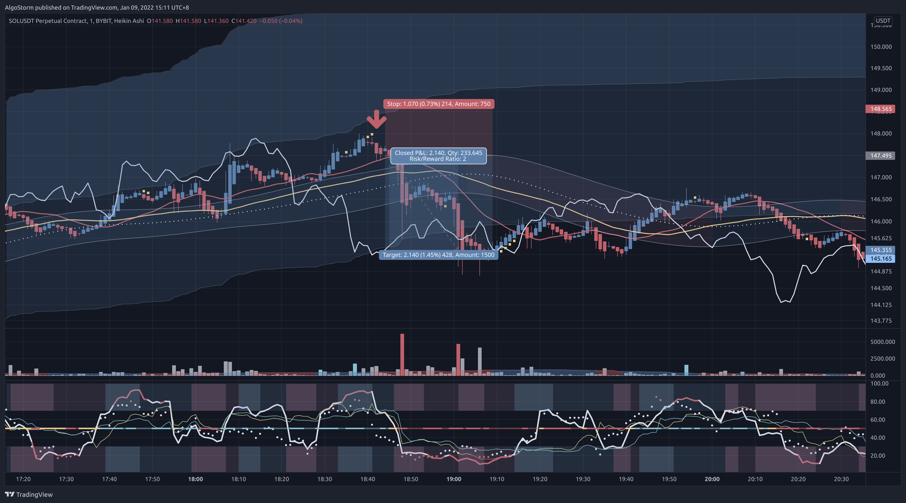

# VWAP Trading Strategy

> Last Edited Date: 09/01/2022

## Introduction

This is a scalping strategy that utilizes the AlgoStorm's premium indicators.

## Requirements

- This scalping strategy is designed for **Cryptocurrencies**.
- First, you need to pick a Crypto exchange with low commissions.
- The asset needs to have a very high market cap. Preferably from the top 50.
- The spread should be very high along with the daily volume.
- The asset needs to have very strong fundamentals, healthy on-chain metrics, and a good, reputable history.
- The assets must fluctuate by at least 1% every 4 hours on average.
- Check our Discord server for our selected list of assets that are suitable for scalping. To join, visit: [AlgoStorm.com](https://algostorm.com)

## Exchange Related Notes

- Our recommended exchange is [Bybit.com](https://www.bybit.com/en-US/invite?ref=YMYQ0%230)
- The commissions on [Bybit.com](https://www.bybit.com/en-US/invite?ref=YMYQ0%230) are (**0.075%**) per action.
- Due to the rebate rate of (**0.025%**) on [Bybit.com](https://www.bybit.com/en-US/invite?ref=YMYQ0%230), you will only have to pay (**0.05%**) commission per trade.
- For closing the order, make a post-only limit order to secure the rebate rate rather than using the take-profit (TP) feature.

## Preparations

- Thoroughly analyze the market structure.
- Identify the **support** and **resistance** zones on 15-minutes, and 1-hour time frames.
- Draw the **trend lines** on the 1-minute time frame.

## Required Indicators

- The AlgoStorm Revolutionary Momentum Decoder (**RMD**) indicator.
- The AlgoStorm Supreme Market Compass (**SMC**) indicator.
- The AlgoStorm Advanced Volume Panel (**AVP**) indicator.

> **Note 1**: You also need an account on [TradingView.com](https://www.tradingview.com/gopro/?share_your_love=labinatorhub) to load the above indicators.

> **Note 2**: You gain access to the required indicators, please join us at [AlgoStorm.com](https://algostorm.com)

## Time Frames

- 1 minute.

## When To Enter?

- Evaluate the position only if the price action is within the **third VWAP deviation** or near the end of the second deviation.
- **Skip** any entry during the first **three hours** of the trading session (i.e. when the VWAP resets). Alternatively, you can use the VWAP deviations from the **previous session** until the first three hours are over.
- At least two candles of **Heikin Ashi** must agree with the direction of the trade.
- The **RMD (14)** must either be overbought (**above 80**) or oversold (**below 20**) depending on the direction of the trade. If the RMD was overbought/oversold within the last **5 candles**, it would still be valid.
- If the **RMDx2** or **RMDx3** or the **RMD of BTC** is also overbought/oversold depending on the direction of the trade, the odds of success greatly increases.
- The **lagging span line** crosses the lower band (for short positions) or upper band (for long positions) of the **ASG Channel**.
- Pay attention to the **volume spikes** on the Advanced Volume Panel (**AVP**) indicator. When you see a spike while the above conditions are valid, then it might be a good signal to start averaging in.
- It is considered an advantage if one or more of the following conditions also applies:
   - If the **[B]** or the **[S]** signs on your chart are printed.
   - If the price action crosses the **20 Simple Moving Average (SMA)**.
   - If the price action enters the **ASG Channel**.

## Where To Place The Stop Loss?

- Place the stop loss **0.40%** below/above the lowest/highest point of the past **7 candles** depending on the direction of your trade.

> **Note 1**: Some expert scalpers do not use a stop loss but instead mark certain invalidation levels. When the price action reaches these levels, they close the order manually. This approach requires full active management, but it improves your win rate since your order will not be closed by some wicks due to market manipulation. Depending on your time schedule and trading style, this technique may or may not be suitable for you. It also requires a great level of discipline since you need to take action and accept the loss at such invalidation levels.

> **Note 2**: Some expert scalpers when they are very confident about their decision and analysis, they also trade without a stop loss while entering in stages similar to how a DCA bot behaves. Then they close the order in stages as well, at certain key levels. This technique is advanced and not recommended for beginners, but it is good to be aware of it since you will reach this level with enough practice and experience.

## When To Take Profit?

- Calculate the take profit by multiplying the distance of the stop loss from the entry by **1.5** as we are using a risk to reward ratio of **1:1.5**.
- You can also consider selling your order in stages at certain key levels.
- For conservative traders, make sure your final take-profit level is not above the VWAP when entering long positions or below the VWAP when entering short positions. In other words, the VWAP is your final target.

## Extra Pro Tips

1. For best results, practice the art of **entering** and **exiting** the order **in stages**.
2. Your position size must not be more than **10%** of your allocated scalping funds.
3. When you are starting out, do not use leverage. When you become consistently profitable for at least **6 months** in a row, you can then consider using very low leverage (**x2-x5**).

## Examples

### Example 1 - SOL/USDT (1-min)

### Example 2 - SOL/USDT (1-min)

